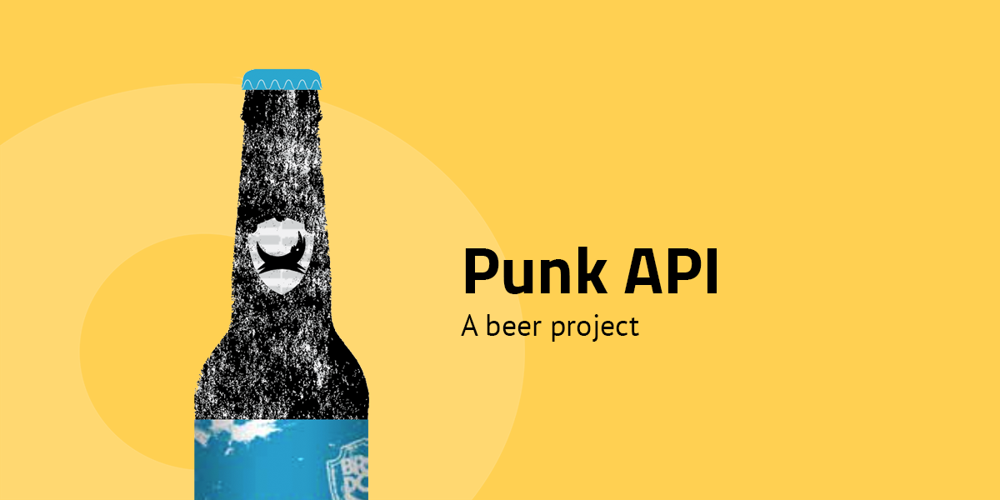

# Punk API

## Instructions

Your are building a beer-wiki that uses data from [Punk API:et](https://punkapi.com/documentation/v2). The web page will have three different views _(see further down for more information on each of the views)_. The views don't necessarily have to be seperate HTML documents. One HTML document that uses JavaScript to dynamically change the different views is totally cool as well. The most important requirement is that only ONE view can displayed at the time. Apart from the requirements that are listed further down, you have free reins.

### Requirements

#### Landing Page (Random beer)

- The user should be presented with a random beer when visiting the this page.

- The user should be able to get a random beer by clicking some sort of button.

- The name and a image of the beer should be presented as a card _(se below for an example)_.

- The uses should be able to click on **See more** to get to the `Beer Info Page` _(see more info further down)_.

#### Search Page

- The user should be able to search for a beer using its name.

- The page should have a form on it that is using the submit event.

- The results of the search should be displayed in a list. Only the name of the beers should be in this list.

- The list can contain a maximum of 10 results. If there are more than 10 beers in the results, the list should be paginated.

- If you click on a beer in the list, you should go to the `Beer Info Page`.

#### Beer Info Page

- This page should only be possible to reach through one of the pages above.

- On this page the user should get detailed information on a specific beer including the following:
  - Description
  - Image
  - Alcohol by volume _(ABV)_
  - Volume
  - Ingredients
  - Hops
  - Food pairing
  - Brewers tips

### Bonus feature

#### Search Page++

- The user should be able to to advanced searches.
- The use should be able to search on one of thes parameters or a kombination of them:
  - Name
  - Hops
  - Malt
  - Brewes Before & Brewed After
  - ABV greater than & ABV less than
- The search form should contain relevant validation.
- Cache the results. If you revisit a beer, you shouldn't need to make another request to the API.
